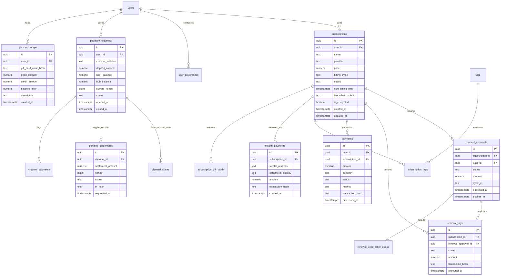
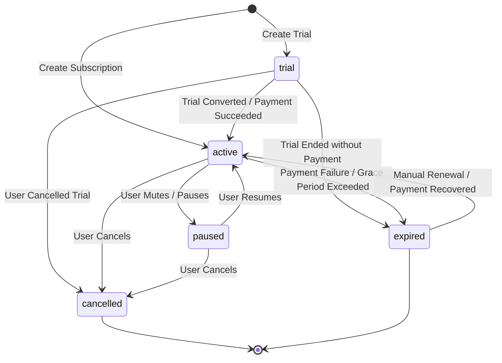
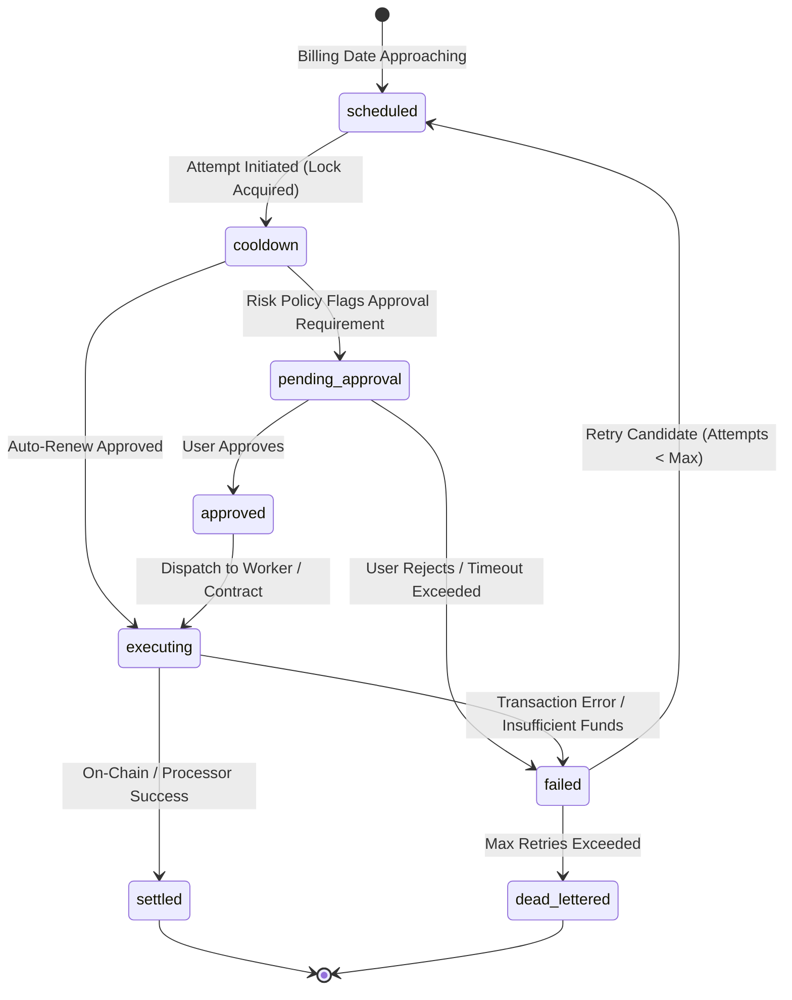
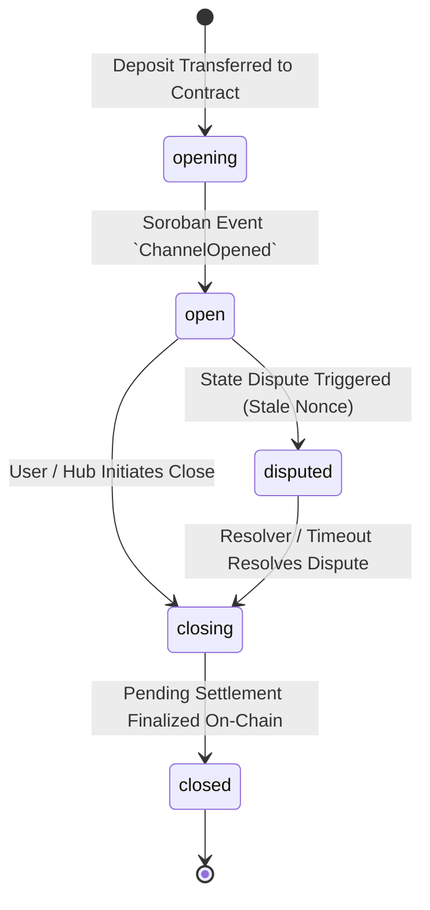
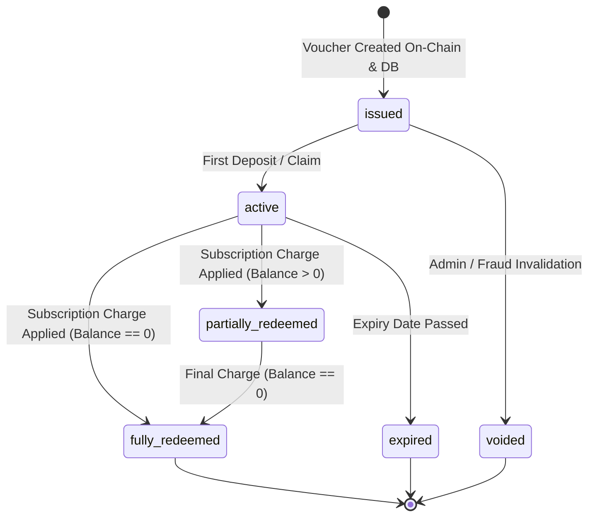

# SYNCRO Canonical Domain Glossary and Data Model Specification

## 1. Executive Summary

This document defines the canonical domain vocabulary, data model, cross-layer entity mappings, field ownership boundaries, entity-relationship diagrams (ERD), and per-entity state machines for the SYNCRO platform. 

Due to the multi-tier architecture spanning Soroban smart contracts (Rust), PostgreSQL database (Supabase), Express backend API (TypeScript), Next.js frontend client (TypeScript/React), and the public SDK (`@syncro/sdk`), single real-world concepts are implemented across different layers under distinct structs, tables, and resources. This document serves as the authoritative single source of truth to eliminate reconciliation bugs and type drift.

---

## 2. Domain Glossary

| Domain Term | Canonical Definition | Smart Contract Representation | Database (Supabase SQL) Representation | Backend API / DTO Resource | Client UI State | SDK Model |
| :--- | :--- | :--- | :--- | :--- | :--- | :--- |
| **Subscription** | A user's recurring service agreement (e.g. Netflix, SaaS) tracked off-chain and optionally linked to an on-chain recurring allowance or NFT registry. | `SubscriptionRegistry::create_subscription` / `subscription_nft` struct | `public.subscriptions` table (`id`, `user_id`, `provider`, `price`, `billing_cycle`, `status`, `blockchain_sub_id`) | `Subscription` DTO in `@syncro/shared` (`GET /api/subscriptions`) | `Subscription` state object, `SubscriptionCard` component | `Subscription` type in `@syncro/sdk` |
| **Renewal** | The periodic event or workflow step of charging/executing funds transfer for an existing subscription for a new billing cycle. | `subscription_renewal::renew` contract method (`subscriber`, `subscription_id`, `amount`, `cycle_id`) | `public.renewal_logs`, `public.renewal_approvals`, `public.renewal_attempts`, `public.renewal_dead_letter_queue` | `RenewalApproval`, `RenewalLog` DTOs (`POST /api/renewals/approve`, `/execute`) | `RenewalItem`, `PendingApprovalModal` UI state | `RenewalApproval` in `@syncro/sdk` |
| **Payment** | A completed or in-flight transfer of value (fiat, Stellar lumens, or stablecoin) executed for a subscription billing cycle or top-up. | `payment-adapter` contract / Stellar network transaction hash | `public.payments`, `public.channel_payments`, `public.stealth_payments` tables | `Payment` interface (`GET /api/payments`, `/api/history`) | `PaymentHistoryRow`, `TransactionStatus` UI state | `Payment` type in `@syncro/sdk` |
| **Charge** | An attempt or authorization to deduct funds via a fiat payment gateway (Stripe/PayPal) or web3 credit pull. | N/A (On-chain operations use `transfer` or `allowance` spend calls) | `public.payments.metadata->'charge_id'`, Stripe charge/intent ID | `ChargeInput`, `StripeChargeResponse` | `CheckoutForm` submission state | `ChargeRequest` in `@syncro/sdk` |
| **Settlement** | The process of finalizing batch off-chain payment channel transactions onto the Stellar ledger. | `payment-channel::settle` contract method | `public.pending_settlements` (`id`, `channel_id`, `amount`, `status`, `tx_hash`) | `PendingSettlement` DTO (`POST /api/channels/:id/settle`) | `SettlementStatusBadge`, `SettlementProgress` | `SettlementResponse` in `@syncro/sdk` |
| **Escrow** | A locked smart contract deposit holding subscriber tokens until renewal criteria, timeout, or resolver resolution occurs. | `escrow` contract struct (`depositor`, `beneficiary`, `amount`, `release_time`, `status`) | `public.escrow_accounts` / contract event mirror in `public.contract_events` | `EscrowDetails` DTO (`GET /api/escrow/:id`) | `EscrowBalanceCard`, `UnlockButton` | `Escrow` type in `@syncro/sdk` |
| **Channel** | A two-party off-chain state channel enabling instant, micro-fee subscription renewals with periodic settlement. | `payment-channel` contract (`user`, `hub`, `user_balance`, `hub_balance`, `nonce`) | `public.payment_channels` and `public.channel_states` tables | `PaymentChannel`, `ChannelState` DTOs | `ChannelBalanceWidget`, `DepositModal` | `PaymentChannel` in `@syncro/sdk` |
| **Card** | A virtual payment card issued for online subscriptions or fiat debit/credit card info. | `virtual-card` contract (`card_id`, `limit`, `expiry`, `owner_address`) | `public.subscriptions.credit_card_required`, virtual card metadata | `VirtualCard` DTO (`GET /api/cards`) | `VirtualCardPreview`, `PaymentMethodSelector` | `VirtualCard` in `@syncro/sdk` |
| **Gift Card** | A pre-funded balance or voucher code redeemable for subscription payments, tracked via an immutable double-entry ledger. | `voucher-ledger` contract (`voucher_id`, `hash`, `balance`, `redeemed`) | `public.subscription_gift_cards`, `public.gift_card_ledger` tables | `GiftCard`, `GiftCardLedgerEntry` DTOs | `GiftCardRedeemForm`, `LedgerHistory` | `GiftCard` in `@syncro/sdk` |
| **Stealth Payment** | A privacy-preserving renewal payment using ephemeral keypairs and stealth meta-addresses to decouple subscriber and merchant identities. | `stealth-announcement` contract (`ephemeral_pubkey`, `stealth_address`, `ciphertext`) | `public.stealth_payments` (`subscription_id`, `stealth_address`, `ephemeral_pubkey`) | `StealthPaymentRecord` DTO | `PrivacyToggle`, `StealthStatusIndicator` | `StealthPayment` in `@syncro/sdk` |

---

## 3. Cross-Layer Term Reconciliation & Naming Discrepancies

Because smart contracts operate under strict Soroban storage constraints while database rows store full relational metadata, entity names intentionally differ across layers. The table below details these mappings and justifications.

```
+----------------------------------------------------------------------------------------------------+
|                                    CROSS-LAYER RECONCILIATION MATRIX                                |
+------------------+-----------------------+-------------------------+-------------------------------+
| Domain Term      | Layer 1: Contracts    | Layer 2: Database (SQL) | Layer 3: Backend & Client DTO |
+------------------+-----------------------+-------------------------+-------------------------------+
| Subscription     | `SubscriptionStruct`  | `public.subscriptions`  | `Subscription` interface      |
|                  | (Soroban BytesN32 ID) | (UUID primary key)      | (JSON DTO with string `id`)   |
|                  | *Mapping: `blockchain_sub_id` column links SQL UUID to Soroban BytesN32 ID*    |
+------------------+-----------------------+-------------------------+-------------------------------+
| Renewal          | `renew()` method      | `renewal_approvals` &   | `RenewalApproval` DTO         |
|                  | (On-chain execution)  | `renewal_logs` tables   | (Status: `pending`, etc.)     |
|                  | *Mapping: SQL tracks workflow approval state; Contract executes token transfer* |
+------------------+-----------------------+-------------------------+-------------------------------+
| Gift Card        | `voucher-ledger`      | `subscription_gift_cards`| `GiftCard` / `GiftCardLedger`  |
|                  | (On-chain Voucher ID) | & `gift_card_ledger`    | (Double-entry accounting DTO) |
|                  | *Mapping: `voucher-ledger` on-chain validates proof; DB stores user ledger balance*|
+------------------+-----------------------+-------------------------+-------------------------------+
| Channel          | `payment-channel`     | `payment_channels` &    | `PaymentChannel` &            |
|                  | (Contract Instance)   | `channel_states`        | `ChannelState` DTOs           |
|                  | *Mapping: Contract holds locked deposit; DB stores off-chain signed state updates*|
+------------------+-----------------------+-------------------------+-------------------------------+
| Virtual Card     | `virtual-card`        | `subscriptions.metadata`| `VirtualCard` DTO             |
|                  | (Soroban Token Cap)   | & card provider table   | (UI Card representation)      |
|                  | *Mapping: Contract enforces spend limits; DB stores provider token references* |
+------------------+-----------------------+-------------------------+-------------------------------+
```

---

## 4. Canonical Data Model & Field Ownership

### 4.1 Field Ownership Rules
1. **Smart Contract Owned**: On-chain balance balances, allowances, nonces, voucher hashes, settlement state roots, and cryptographic commitment blinding factors. Contracts are the single source of truth for financial execution.
2. **Database (Supabase) Owned**: User profiles, notification preferences, off-chain subscription metadata (provider name, category, website URL, tags), renewal approval queues, audit trails, and correlation IDs.
3. **Payment Processor Owned**: External transaction tokens, Stripe/PayPal charge IDs, payment gateway customer IDs.
4. **Client/User Owned**: Local plaintext display names, decrypted memory tokens, ephemeral key derivations, unsubmitted form inputs.

---

## 5. Entity-Relationship Diagram (ERD)



---

## 6. Per-Entity State Machines

### 6.1 Subscription State Machine (`SubscriptionStatus`)



| Source State | Target State | Trigger Event | Guard Condition / Rule |
| :--- | :--- | :--- | :--- |
| `[*] ` | `active` | Subscription Creation | Valid price and billing cycle provided |
| `[*] ` | `trial` | Trial Setup | `is_trial = true` and `trial_ends_at` defined |
| `trial` | `active` | Conversion | Successful initial payment transaction |
| `trial` | `expired` | Expiry | `now() > trial_ends_at` without converted payment |
| `active` | `paused` | Pause Request | User toggles pause; `resumes_at` optional |
| `active` | `cancelled` | Cancellation Request | User or admin triggers cancellation |
| `active` | `expired` | Renewal Failure | Payment attempts exhausted & cooldown elapsed |
| `paused` | `active` | Resume Request | User reactivates subscription |

---

### 6.2 Renewal State Machine (`RenewalState`)



| Source State | Target State | Trigger Event | Actions & Ownership |
| :--- | :--- | :--- | :--- |
| `scheduled` | `cooldown` | `cron` / Scheduler trigger | `renewal_locks` table acquires lock |
| `cooldown` | `pending_approval` | Risk detection trigger | Insert row into `renewal_approvals` (`status = pending`) |
| `cooldown` | `executing` | Low-risk auto-renewal | Direct dispatch to worker queue |
| `pending_approval` | `approved` | User clicks Approve | `approved_at` timestamp recorded |
| `executing` | `settled` | On-chain TX receipt verified | Log added to `renewal_logs`; next billing date advanced |
| `failed` | `dead_lettered` | Retry count >= 5 | Entry added to `renewal_dead_letter_queue` |

---

### 6.3 Payment Channel State Machine (`ChannelStatus`)



---

### 6.4 Gift Card Ledger State Machine (`GiftCardLedgerStatus`)



---

## 7. Governance and Code Review Standards

1. **New Database Tables & Columns**: Must strictly use names defined in Section 2. If introducing a new domain concept, update this document via PR prior to merging SQL migrations.
2. **Soroban Contract Interfaces**: Struct and function names in `contracts/contracts/` must map directly to the cross-layer reconciliation table in Section 3.
3. **TypeScript DTOs**: All DTO interface definitions must reside in `@syncro/shared` under `shared/src/types/` and reference `docs/DOMAIN_GLOSSARY_AND_DATA_MODEL.md`.
4. **PR Checklist Requirement**: Every PR touching `contracts/`, `supabase/migrations/`, `backend/`, `client/`, or `sdk/` must verify compliance with this specification.
