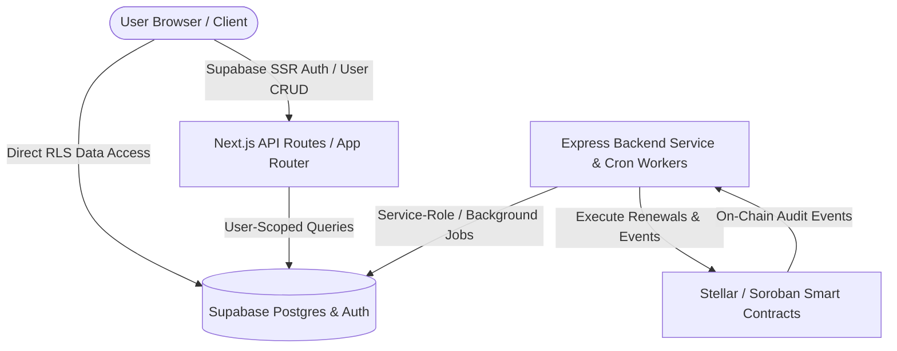

# SYNCRO Contract & System Architecture Blueprint

High-level design overview for decentralized subscription billing on Stellar/Soroban.

---

## Architecture Decision Records (ADRs)

All foundational decisions, system boundaries, trust assumptions, and ledger mechanisms are recorded in the canonical [Architecture Decision Record Index](./adr/README.md).

Key architectural decisions governing this blueprint include:

- **Frontend/Backend Split**: [ADR-001](./adr/ADR-001-frontend-backend-split.md) — Next.js owns user data plane; Express owns long-running background execution plane.
- **Smart Contract Platform**: [ADR-002](./adr/ADR-002-soroban-over-evm.md) — Stellar Soroban (Rust Wasm) for sub-cent fees, sub-second finality, and native XLM/USDC rails.
- **Managed Database & Auth**: [ADR-003](./adr/ADR-003-supabase-over-self-managed-db.md) — Supabase Postgres, Auth, and Row-Level Security.
- **Phase 1 Onboarding**: [ADR-004](./adr/ADR-004-gift-cards-for-phase-1.md) — Prepaid Crypto Gift Cards for zero-friction user onboarding.
- **Automated Renewal Mechanism**: [ADR-005](./adr/ADR-005-payment-channels-for-renewals.md) — Pre-authorized execution windows and agent-mediated payment channels.
- **High-Value Subscriptions**: [ADR-006](./adr/ADR-006-funds-in-escrow.md) — Arbiter-mediated escrow contracts with dispute resolution.
- **Financial Integrity**: [ADR-007](./adr/ADR-007-double-entry-gift-card-ledger.md) — Immutable double-entry ledger database schema.
- **Zero-Knowledge Privacy**: [ADR-008](./adr/ADR-008-wallet-hkdf-encryption.md) — HKDF-SHA256 client-side encryption key derivation from Stellar wallet keys.
- **Database Authorization**: [ADR-009](./adr/ADR-009-row-level-security-authorization.md) — Row-Level Security (RLS) as mandatory data isolation boundary.
- **Resilient Rate Limiting**: [ADR-010](./adr/ADR-010-quota-guard-rate-limiting.md) — Quota Guard dual-engine rate limiter (Redis + Memory fallback).

---

## Core System Boundaries

